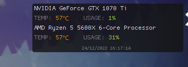
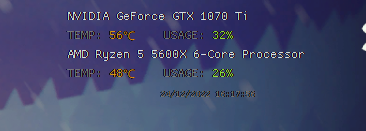

# Processor-Monitor
Processor Monitor, a Temperature and usage overlay made in c#
built using openhardware lib, I wont pretend that i made most of this code.

Made as a simple replacement for an overlay that shows usage and temeprature of the CPU and GPU, it is within a few degrees or exact as temperature,  if this is causing any issues, feel free to use a professional overlay such as MSI Afterburner or other alternatives

